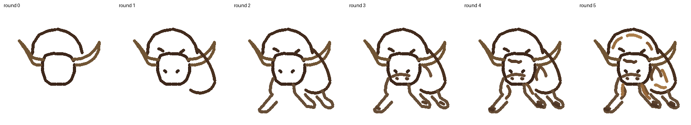
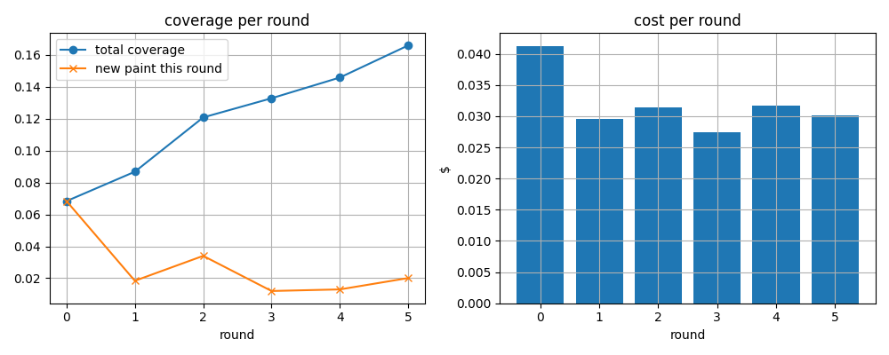
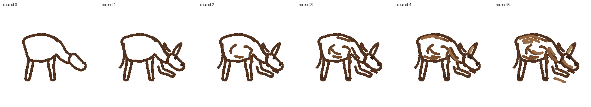
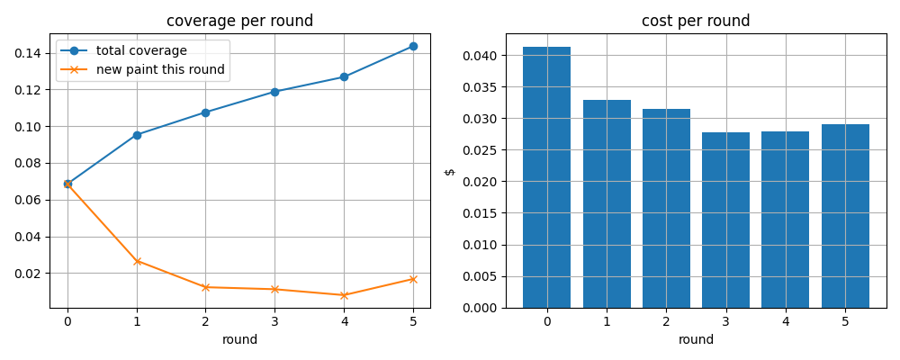
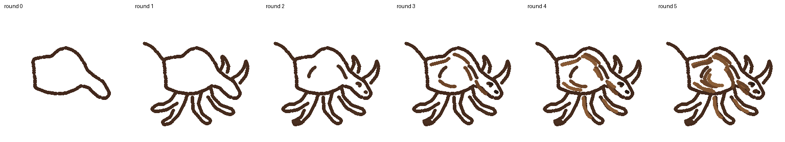
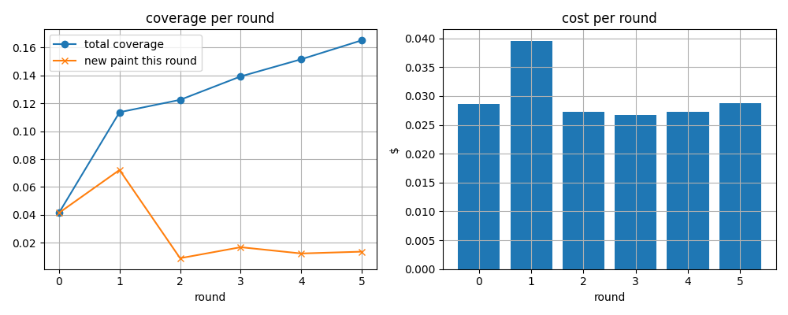

# Astra Paints (Physics Simulator!)

Inspired by [Thijs](https://github.com/tandpfun), I'm taking on a *simulated* angle of what Astra's application to robotics can do (and how I should burn through some OpenAI Developer Credits!). I made a simulated version of painting, which is less cool than the physical version.

Here is what I have!

## TLDR

Attempt 3: Bull Passed ✅




Attempt 2: Bull -> Donkey



Attempt 1: Bull -> Beetle




## To start

```
pip install -r requirements.txt
python run.py --agent scripted --subject bridge
```

Architecture goes from agent -> strokes -> arm -> stamping on timelapse.

## To run

Cleanest way to evaluate everything (using the charging bull as an example)

```
# 1. Paint (6 calls)
python3 run.py --agent astra --subject "charging bull" --rounds 6

# 2. Point at the new run dir (copy the timestamp from the "saving to" line)
export R=results/charging_bull/charging_bull-astra-<timestamp>

# 3. Judge it blind (1 call)
python3 evals/judge.py $R --expect bull

# 4. Visuals (free)
python3 evals/contact.py $R
python3 evals/plots.py $R
python3 evals/annotate.py $R
```